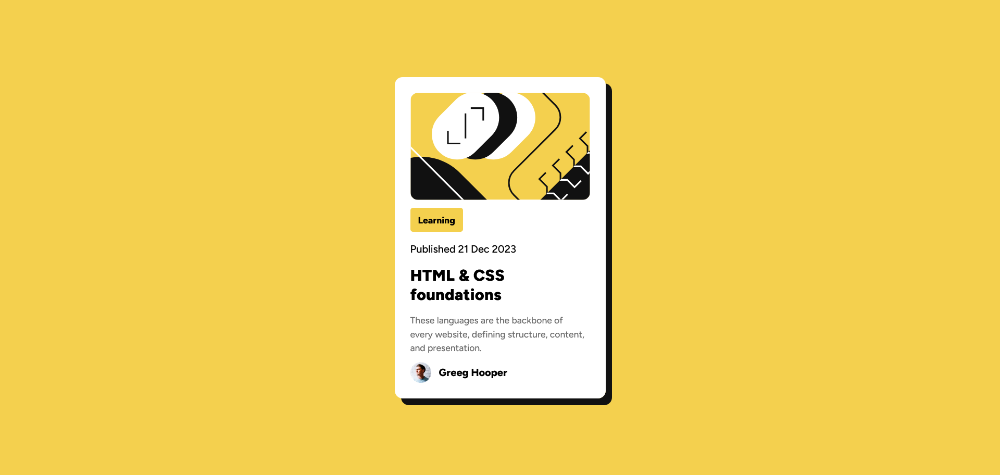

# Frontend Mentor - Blog preview card solution

This is a solution to the [Blog preview card challenge on Frontend Mentor](https://www.frontendmentor.io/challenges/blog-preview-card-ckPaj01IcS). Frontend Mentor challenges help you improve your coding skills by building realistic projects.

## Table of contents

- [Overview](#overview)
  - [The challenge](#the-challenge)
  - [Screenshot](#screenshot)
  - [Links](#links)
- [My process](#my-process)
  - [Built with](#built-with)
  - [What I learned](#what-i-learned)
  - [Continued development](#continued-development)
  - [Useful resources](#useful-resources)
  - [AI Collaboration](#ai-collaboration)
- [Author](#author)
- [Acknowledgments](#acknowledgments)

## Overview

### The challenge

Users should be able to:

- See hover and focus states for all interactive elements on the page

### Screenshot



### Links

- Live site URL: [Github pages link](https://conquerant2135.github.io/responsive-card/)
- Solution URL : [Github repository link](https://github.com/Conquerant2135/responsive-card/)

## My process

### Built with

- Semantic HTML5 markup
- CSS custom properties
- Flexbox
- CSS Grid

### What I learned

I learned how to include external downloaded font in css

```css
@font-face {
  font-family: Figtree-ExtraBold;
  src: url("../fonts/static/Figtree-ExtraBold.ttf");
}
```

Also how to make css variable , it makes life easier with color and common spacement

```css
:root {
  --yellow: #f4d04e;
  --gray-950: #111111;
  --gray-500: #6b6b6b;
  --white: #ffffff;
  --spacing-300: 24px;
  --spacing-150: 12px;
  --spacing-100: 8px;
  --spacing-50: 4px;
}
```

### Continued development

I want to work more on how to make good responsive design with css or with a framework like bootstrap cause I struggle a lot with making responsive stuff , usage of % or rem instead of directly pixel and when to use then properly . 

Also working on working faster 

### Useful resources

- [font manipulation](https://www.w3schools.com/css/css3_fonts.asp) - This helped me for including the external downloaded font .
- [css variable](https://developer.mozilla.org/en-US/docs/Web/CSS/Guides/Cascading_variables/Using_custom_properties) - This teached me how to make css variable

### AI Collaboration

## Author

- Frontend Mentor - [@Conquerant2135](https://www.frontendmentor.io/profile/Conquerant2135)
- Github - [@Conquerant2135](https://github.com/Conquerant2135)

